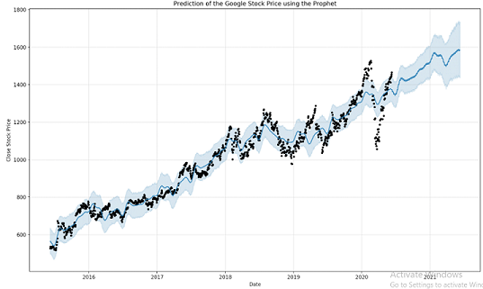

# Makine Öğrenmesinin Kullanımı
Makine Öğrenmesi günümüzde birçok alanda kullanılıyor .
Bunlar ::
- Görüntü İşleme

- Dil işleme

- Robotik Öğrenme

- Veri Bilimi

## Hisse Senedi Fiyat Tahmini

Bu blog yazısında aldığım veri bilimi dersinden edindiğim bilgiler doğrultusunda makine öğrenmesini irdeliyeceğim.

Hisse senedi piyasası  öngörülemeyen ve doğası gereği doğrusal olmayan bir piyasa olarak tanımlandırılır.

Kazancı en üst seviyeye çıkarmak için Makine Öğrenmesi ile hisse senetlerinin gelecekteki fiyatlandırmalarına yönelik tahminleri elde edebiliyoruz.

Bu tahminler doğrultusunda hisse alım satım işlemleri yapan uygulamalar oluşturabiliyoruz.

Örnek olarak python dili ile yazılmış bir Makine Öğrenmesi kodu inceleyelim.

import matplotlib.pyplot as plt

%matplotlib inline

#setting figure size

from matplotlib.pylab 

import rcParams

rcParams['figure.figsize'] = 20,10

#for normalizing data

from sklearn.preprocessing 

import MinMaxScaler

scaler = MinMaxScaler(feature_range=(0, 1))

#read the file

df = pd.read_csv('NSE-TATAGLOBAL(1).csv')

#print the head

df.head()